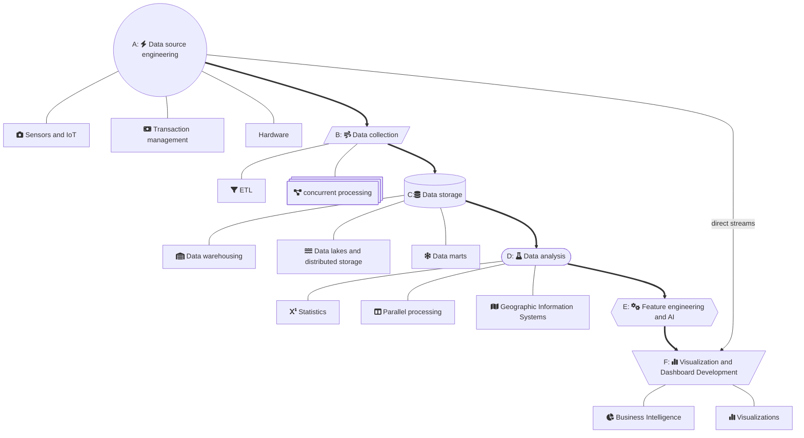
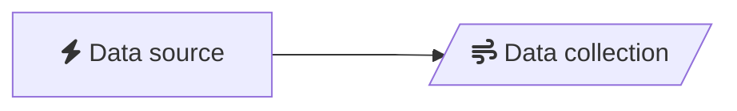
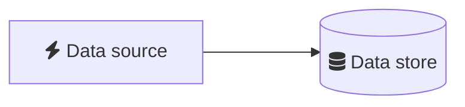
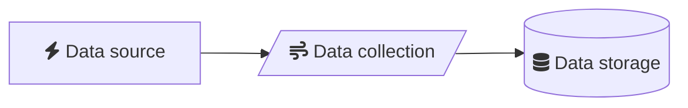
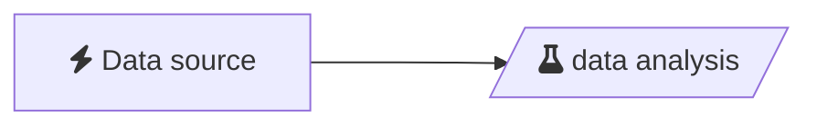
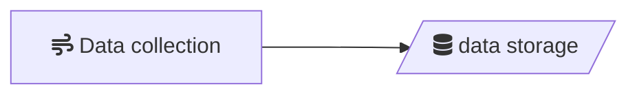
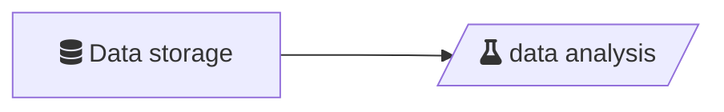
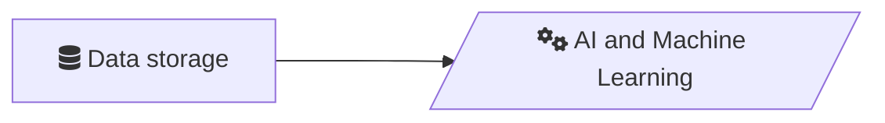
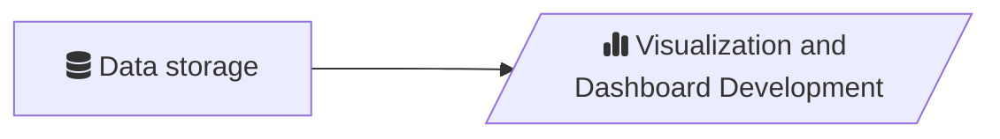

<!-- font awesome support -->

<link
  href="https://cdnjs.cloudflare.com/ajax/libs/font-awesome/6.5.1/css/all.min.css"
  rel="stylesheet"
/>

<!-- end style support -->

#  Data Analytics Framework 

This document describes a draft framework to evaluate the coverage of a data analytics program from a content perspective.

## Analytics Coverage

The image below outlines the six main concepts to be covered in data analytics.

- Data sourcing
- Data Collection
- Data storage
- Data analysis
- Feature engineering and AI
- Visualization and dashboards

While these all involve the main elements of the data pipeline there are a number of other considerations as well.

- Relevant domains of operation (e.g. Fintech, Health, Government).
- Ethics, security and privacy.
- IT and software fundamentals.
- Deployment and development operations




## A-B Relationships - Raw Data Sourcing and telemetry

An AB course is focussed on the main ways of collecting data from an endpoint and using it to perform some action. 

- Cloud-based robotics
- Transaction and other logging
- End point development and management
- Telemetry




## A-C - Application Storage

An AC course focusses on the storing of information such as transactions or content in a client-server relationship.
- Web applications
- Native development
- Point of Sale (POS) systems



## ABC - Data Engineering

Focussed on developing pipelines from a data source to eventually be stored in a data system, before or after cleaning.

- structured data storage and ETL
- data cleaning
- event streaming and stream processing



## A-D - Exploratory data analysis and sampling

Data (usually small samples) prepared from a raw source for analysis for the purposes of exploring some small aspect of the data for future deployment. The data is usually small and preprepared.

- Principle component analysis
- factor analysis
- cluster analysis
- data cleaning
- open data analysis



## BC - Data Stream Production and Quality

A subset of data engineering focussed on producing data from an event or other stream for the purposes of storage.

- Data quality testing
- Data cleaning
- Actor-model and other messaging systems.
- Data engineering dev-ops



## CD - Data Warehousing and management

Allocating data for the purposes of analysis. 

- Data modelling
- Data description and metadata
- Data marts
- Structured queries (SQL)



## CE - Feature Engineering

Identifying features in data for the purposes of developing machine learning and artificial intelligence models.

- Automation
- Supervised machine learning
- Feature modelling



## BCDE - Data Science

Using the scientific method to uncover insights from prepared data sources.

- Big data analysis
- Predictive analysis
- Social network analysis


## CDEF - Applied Artificial Intelligence
- Unsupervised machine learning
- Reinforcement learning
- ML Operations


## CF - Data Analytics

Collecting samples of data for dashboard development and visualization.



## DF - Data Stories

Turning the results of data analysis into a compelling story for strategic purposes.

```mermaid

```

## ABCDEF - End-to-End Data Science and Artificial Intelligence

